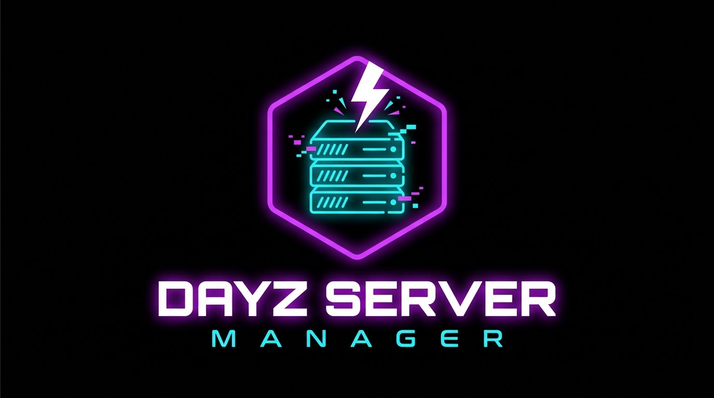

  

# DayZ Server Manager

Application Windows pour installer et gérer un serveur DayZ en quelques clics, par **Spadeure**.

## Fonctionnalités

- [x] Interface moderne, thème violet néon
- [x] Choix du dossier d'installation
- [x] Vérification des dépendances (Visual C++, DirectX, SteamCMD)
- [ ] Téléchargement de SteamCMD et des fichiers serveur DayZ
- [ ] Installation automatique des dépendances
- [ ] Ouverture des ports dans le pare-feu Windows
- [ ] Configuration du serveur (`serverDZ.cfg`)
- [ ] Mise à jour automatique de l'application

## Téléchargement

Rendez-vous dans l'onglet **Releases** et téléchargez `DayZServerManager.exe`.

- Windows 10 ou 11, 64 bits
- L'application demande les droits administrateur (nécessaires pour le pare-feu et les dépendances)

## Crédits

Police Orbitron : Matt McInerney, licence SIL Open Font License (voir `src/DayZServerManager/Fonts`).
